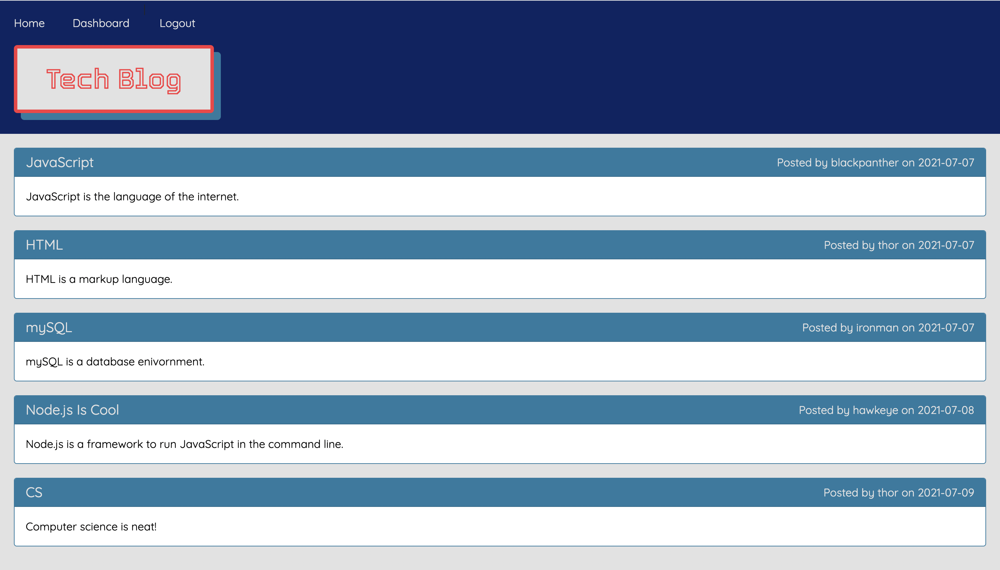

# Tech Blog


# Project 2 - Super Auction Kart

## Background

This was a project for the UofT Bootcamp.

## Table of Contents
[Description](#description)\
[Motivation](#motivation)\
[User Story](#user-story)\
[Technologies](#technologies)\
[License](#license)\
[Process](#process)\
[Screen Shot](#screen-shot)\
[Links](#links)


## Description

The Tech Blog is a CMS-style blog site similar to a Wordpress site, where developers can publish their blog posts and comment on other developers’ posts as well.  The app follows the MVC paradigm in its architectural structure, using Handlebars.js as the templating language, Sequelize as the ORM, and the express-session npm package for authentication.

## Motivation

Writing about tech can be just as important as making it. Developers spend plenty of time creating new applications and debugging existing codebases, but most developers also spend at least some of their time reading and writing about technical concepts, recent advancements, and new technologies.

## User Story

```md
AS A developer who writes about tech
I WANT a CMS-style blog site
SO THAT I can publish articles, blog posts, and my thoughts and opinions
```

## Technologies

* HTML & CSS
* JavaScript
* MySQL
* Dependencies: Bcrypt, Dotenv, Express + Handlebars, MySQL2, and Sequelize


## License

[MIT License](https://choosealicense.com/licenses/mit/)

## Process

* For this project we started from scratch.  I looked at the readme example for a wire frame and to see how the data was related so I could build the models.
* From there I followed the MVC paradigm to complete the project. 
* The biggest challenges for this project was the size of the project and keeping track of all the moving peices.  When something broke or a change was made often times there were cascading effects.
* The successes for this project was getting a better understanding of a full stack application and learning about debugging and fixing my code.
* Credit to my tutor, TA's, and classmates for their help.

## Screen Shot



## Links

Repository: https://github.com/harviator/tech-blog \
Deployed: https://enigmatic-taiga-76650.herokuapp.com/